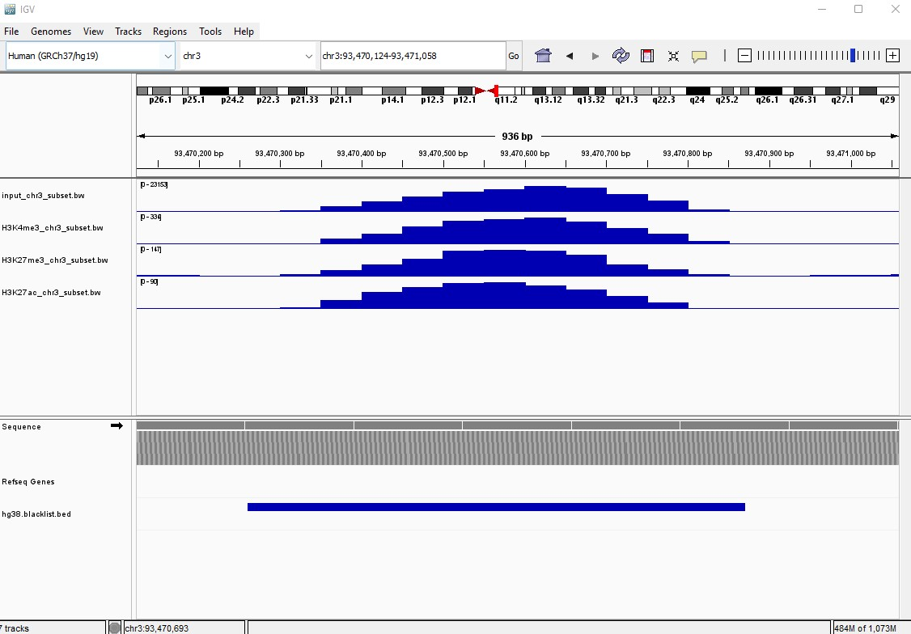
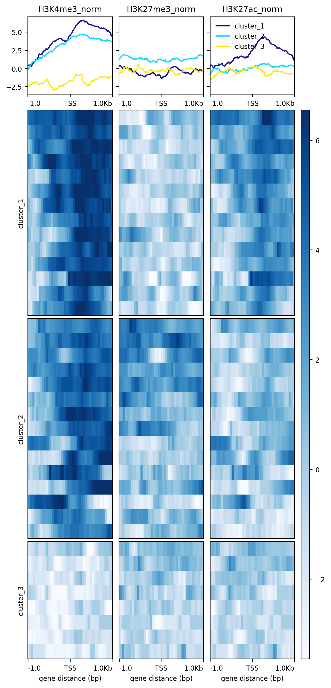
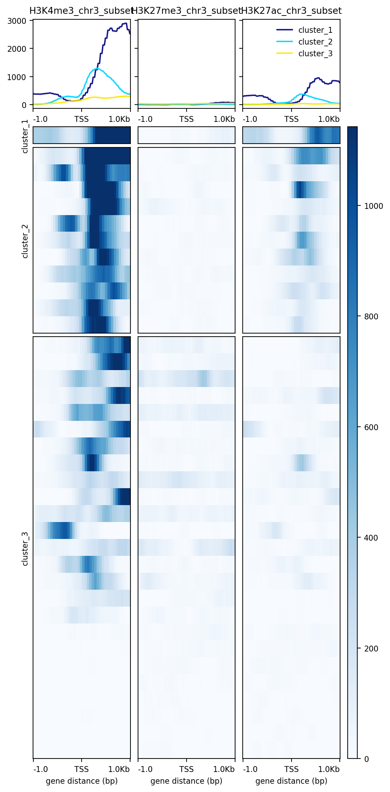
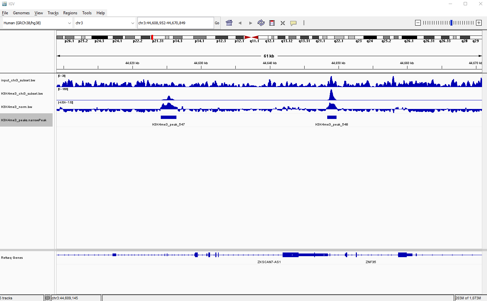
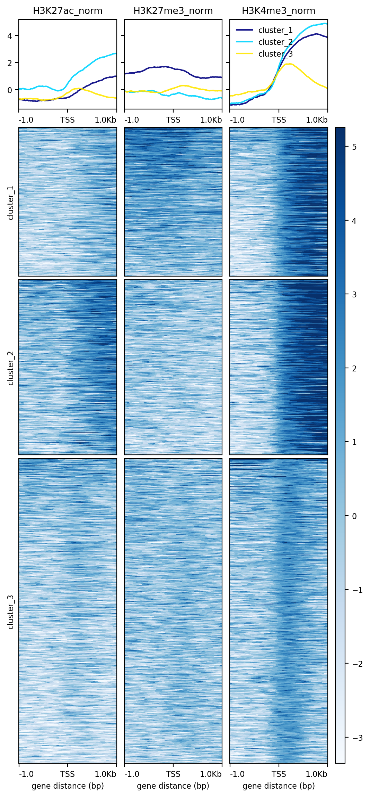
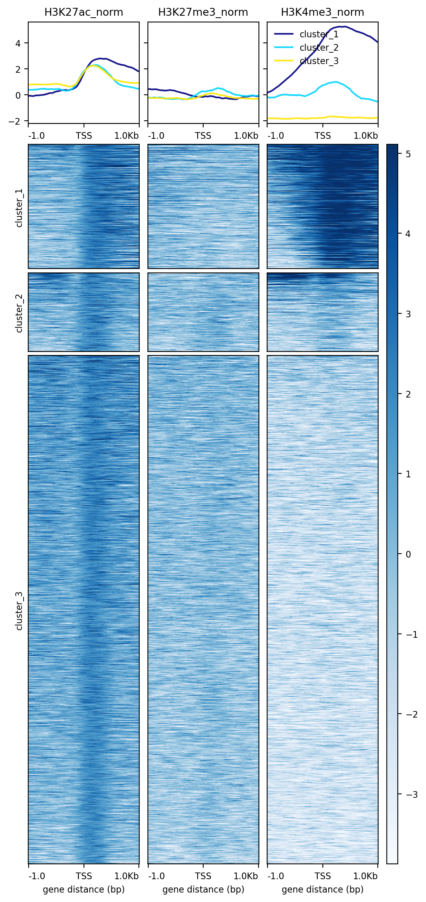
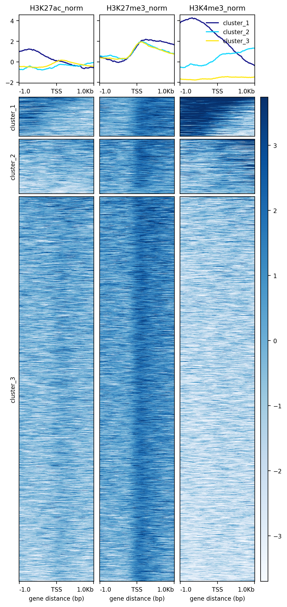

# Assignment Overview

By now you must have become vaguely familiar with ChIP-seq data but might be a little confused about what to do after the alignment. Well, this assignment's aim is to walk you through a ChIP-seq pipeline post-alignment. We will be analyzing 3 different histone modification marks (H3K27me3, H3K4me3 and H3K27ac). In order to identify the enrichments for each epigenetic mark, we also need to use the *input* which represents the DNA content of the sheared chromatin sample prior to immunoprecipitation. All the files can be found under the following path: **/projects/bmeg/A5/** . 

  - H3K27me3 (H3K27me3_chr3_subset.bam) 

  - H3K4me3 (H3K4me3_chr3_subset.bam) 

  - H3K27ac (H3K27ac_chr3_subset.bam) 

  - input (input_chr3_subset.bam)


A couple of things to remember: 

- When uploading your completed assignment to your GitHub directory, remember to specify a **github_document** instead of the default *html_document* on your .Rmd file. 

- Double check that all the files have been uploaded to your repository and that you are able to visualize the html-like version on GitHub. 

- Be mindful of your space on the server! Delete ALL unnecessary files and keep a clean environment. 


## 0. Getting Started 

We will be using a couple of new tools this time. Before we move on to the practical part, make sure you have them all installed. 

  - Integrative Genomics Viewer (IGV): Interactive tool to visualize different data types of genetic information (e.g. bam, bed files). You will install this tool to your **local computer**. To visualize where the reads of our ChIP analysis mapped in the genome. To install it, follow the instructions on this website: *https://software.broadinstitute.org/software/igv/home*
  
  - Deeptools (https://deeptools.readthedocs.io/en/develop/index.html): Software to analyze high-throughput data that allows to create easy to visualize figures. This will be installed on the server as part of your conda environment.
  
  - macs2 (https://github.com/macs3-project/MACS/blob/master/docs/callpeak.md): Tool to capture enrichments of ChIP-seq analysis. This will be installed on the server as part of your conda environment.
  

```{bash, eval=FALSE}
#?# Add macs2 and deeptools to your environment created on A1 - 1 pt
## Install IGV to your local computer after downloading it from: https://software.broadinstitute.org/software/igv/home

conda activate bmeg591e
conda install -c bioconda macs2
conda install -c bioconda deeptools
```


## 1. ChIP signal tracks 

ChIP-seq experiments require a control against which to compare the ChIP signal. Often this is the "input DNA", sheared chromatin that has not been immunoprecipitated. For this assignment we are using an input and three different epigenetic marks. These histone modifications mark states of active (H3K27ac, H3K4me3) or inactive (H3K27me3) gene transcription and have different coverage of the genomic region where they are located. To better visualize the differences, we will create bigWig files from previously aligned, filtered and indexed bam files. BigWig files are indexed, compressed files that can be used to visualize signals across the genome. Here, we will be using it to graph the coverage across the genome.


```{bash, eval=FALSE}
## Use the bamCoverage command (included in deepTools) to convert the bam files outlined below (located in the /projects/bmeg/A5/ directory) into bigwig files that represent the read coverage (e.g. density of reads across the genome). Each file has already been indexed using sambamba and hence, has it's bam index (.bai) file associated that you will need to run bamCoverage. 
## Tip: Remember to add the .bw extension to your specified output! 
#?# Type the commands you use for converting each of the 4 bam files to bigwig files - 2 pts
## input_chr3_subset.bam
bamCoverage -b input_chr3_subset.bam -o input_chr3_subset.bw

## H3K4me3_chr3_subset.bam
bamCoverage -b H3K4me3_chr3_subset.bam -o H3K4me3_chr3_subset.bw

## H3K27me3_chr3_subset.bam
bamCoverage -b H3K27me3_chr3_subset.bam -o H3K27me3_chr3_subset.bw

## H3K27ac_chr3_subset.bam
bamCoverage -b H3K27ac_chr3_subset.bam -o H3K27ac_chr3_subset.bw

### Follow this steps: 
## 1. Copy the bigwig files from the previous steps to your computer
On local command prompt: pscp elamoureux_bmeg22@orca1.bcgsc.ca:assignments/assignment_5/input_chr3_subset.bw c:\users\eriks\bmeg_591e\input_chr3_subset.bw

pscp elamoureux_bmeg22@orca1.bcgsc.ca:assignments/assignment_5/H3K4me3_chr3_subset.bw c:\users\eriks\bmeg_591e\H3K4me3_chr3_subset.bw

pscp elamoureux_bmeg22@orca1.bcgsc.ca:assignments/assignment_5/H3K27me3_chr3_subset.bw c:\users\eriks\bmeg_591e\H3K27me3_chr3_subset.bw

pscp elamoureux_bmeg22@orca1.bcgsc.ca:assignments/assignment_5/H3K27ac_chr3_subset.bw c:\users\eriks\bmeg_591e\H3K27ac_chr3_subset.bw
## 2.Load all the files bigwig signal track files onto IGV on your local computer, select the "autoscale" option for each file on their individual tracks
## Tip: use the "File" tab to "load from file" option to choose the files from your computer directories
## 3. Change the visualization of the files to see the following position: ** chr3:93,470,124-93,471,058 **
#?# Include a screenshot of your IGV session right after this code chunk (using the Rmarkdown syntax)  - 2 pt
#?# Explore this region by zooming in and out and navigating around. What do you see? Is there something similar across all the different files that stands out on this region? Is there anything peculiar about the DNA sequence at this locus?- 3 pt
After zooming in and out, it is clear that the chr3:93,470,124-93,471,058 region is similar between the four files. Relative to nearby areas, this position is highly expressed. Due to the autoscaling option, when chr3:93,470,124-93,471,058 is in the frame it has the highest response compared to nearby areas. When I navigate away from chr3:93,470,124-93,471,058, the autoscaling readjusts and the response for other positions enlarges and becomes more clear. 
## Tip: sometimes track signal will be truncated to a pre-set maximum. If you right-click the track label (left) and select "autoscale", it will automatically adust the scales of the track to the range of your data. Try playing around with the track settings to see their effect.
## 4. This file (/projects/bmeg/A5/hg38_blacklisted_regions.bed) contains the hg38 blacklisted regions. Load it into IGV along with all the other files. 
On local command prompt: pscp elamoureux_bmeg22@orca1.bcgsc.ca:assignments/assignment_5/hg38.blacklist.bed c:\users\eriks\bmeg_591e\hg38.blacklist.bed
## 5. Look at the following region again (chr3:93,470,124-93,471,058). 
#?# What can you say now about the similarities between the files at this region? In your own words, explain what a blacklisted region is and if you think this region should be excluded a ChIP-seq analysis. - 1.5 pt
After adding the hg38.blacklist.bed file to IGV, it displays coverage of chr3:93,470,261-93,470,870. This range is slightly less than the specified chr3:93,470,124-93,471,058, covering the area of greatest response in this position. The blacklisted region of a genome describes areas with anomalous, unstructured, or high-signals, independent of cell line or experiment. The exclusion of this blacklist in ChIP-seq is an essential quality measure when analyzing functional genomics data. https://www.nature.com/articles/s41598-019-45839-z 

```

**Add screenshot of your IGV session here: **. (Use Rmarkdown syntax)



## 2. Narrow vs Broad peaks 

While exploring the bigwig files of the epigenetic marks on IGV, you probably noticed that they can look very different from each other and some of them reassemble the input more closely than others. Different epigenetic marks can have very different signatures based on their distribution patterns across the genome. When calling peaks, we often lump these into two different categories of reads: broad and narrow. Active transcription marks (H3K4me3 and H3K27ac) tend to form a sharper coverage peaks at transcription start sites (H3K27ac is also at enhancers), while repression marks cover a broader area (H3K27me3). Here, we're going to inspect their distributions relative to genes.

```{bash, eval=FALSE}
## Here, we have created three bigWig track files, one for each epigenetic mark, which show the read coverage normalized using the input. They are found here: /projects/bmeg/A5/
# H3K4me3_norm.bw
# H3K27me3_norm.bw
# H3K27ac_norm.bw
## The deepTools ** computeMatrix reference-point ** command calculates scores to represent the reads mapping to specified regions of the genome across different files. 
## Use computeMatrix to compute a matrix for the signal tracks for each histone modification outlined above (which we will use to create a plot in the following step), with the following criteria: 
## - We will use the regions in reference_genes.bed located under the /projects/bmeg/A5/ directory as the basis for the plot.
## - Include the surrounding 1kb
## - Use all 3 input-normalized bigWig files (H3K4me3, H3K27ac, H3K27me3) as signal tracks
#?# Write the command you used to run it below: - 1.5 pt
computeMatrix reference-point -S H3K4me3_norm.bw H3K27me3_norm.bw H3K27ac_norm.bw -R reference_genes.bed -a 1000 -b 1000 -o matrix_ref.gz
## Now that the scores matrix has been computed, we can use it to create a heatmap to provide a better visual representation of the reads distrubution across our reference genes (provided in the reference_genes.bed file)
## Use the deepTools ** plotHeatmap ** function to create a heatmap following this criteria: 
## - Use the matrix from the previous point
## - Use the Blues colormap
## - Create 3 clusters within the heatmap according to the patterns of the reads distrubution across the files using heirarchical clustering
#?# Type the command you used to run it below: - 1.5
plotHeatmap -m matrix_ref.gz -o heatmap.png --colorMap Blues --hclust 3
#?# Add a screenshot of the plot right after this code chunk using Rmarkdown syntaxis - 1 pt
On local command prompt: pscp elamoureux_bmeg22@orca1.bcgsc.ca:assignments/assignment_5/heatmap.png c:\users\eriks\bmeg_591e\heatmap.png
#?# Explain what you are looking at (Axes, colours, curves). Where are the marks located? What are the differences between the clusters? - 3 pts
In the heatmap.png image, the top row of images displays the H3K4me3_norm, K3K27me3_norm, and H3K27ac_norm in separate subplots, each including all three clusters. The x-axis displays the genome position from -1.0 kb to +1.0 kb and the y-axis displays the average weight of the heatmap. Below these curves are the heirarchical clustered heatmap plots. Darker colours indicate greater heatmap weight. The number of hierarchical clusters was defined to be 3, as such the output heatmaps used this hyper parameter with the ward linkage algorithm to hierarchically cluster the data into 3 groups.  
```

**Add screenshot here: ** (Use Rmarkdown syntax)



```{bash, eval=FALSE}
## Now the above heatmap was made with the ratio of ChIP to input. Repeat the process above, but this time using the raw bigwig files (not input-normalized). 
#?# Type the commands you used for this below - 1 pt
computeMatrix reference-point -S H3K4me3_chr3_subset.bw H3K27me3_chr3_subset.bw H3K27ac_chr3_subset.bw -R reference_genes.bed -a 1000 -b 1000 -o matrix_ref_not_norm.gz
plotHeatmap -m matrix_ref_not_norm.gz -o not_norm_heatmap.png --colorMap Blues --hclust 3
#?# Include a screenshot of this analysis, below this code block. - 1 pt
On local command prompt: pscp elamoureux_bmeg22@orca1.bcgsc.ca:assignments/assignment_5/not_norm_heatmap.png c:\users\eriks\bmeg_591e\not_norm_heatmap.png
#?# How does this compare to the input-normalized data? Why do you think this is? - 1 pt
The non-normalized output is much less clear than the normalized output. There is very little information to be obtained from H3K27me3_chr3 as all of the heatmap outputs are near zero. Further, the third cluster of H3K27ac is also all near zero. This is because the heatmap outputs from H3K4me3 are much stronger than the others in absolute terms, suppressing the latters outputs. When the data is normalized, it is normalized to each bigwig file, allowing for relative differences to be obtained. 
```

**Add screenshot here: ** (Use Rmarkdown syntax)



## 3. Peak calling 

Now we want to identify enriched regions of the genome for each of our three histone marks. In order to get the enrichments, we will run the **macs2** program to call the peaks for each epigenetic mark. 

### a. Peak calling with macs2


```{bash, eval=FALSE}
## Tip: Make sure to read the documentation (using the -h flag) for the *masc2 callpeak* command
macs2 callpeak -h
## Run the callpeak command of the macs2 tool, once for each of H3K27ac, H3K27Me3, H3K4Me3
## Each time, use the input as the control 
## For H3K27Me3, you should call "broad" peaks because these signals tend to form longer domains and not acute peaks.
#?# Type the commands you used below: - 1.5 pt
macs2 callpeak -t H3K27ac_chr3_subset.bam -c input_chr3_subset.bam -f BAM -n H3K27ac --outdir H3K27ac_callpeaks

macs2 callpeak -t H3K27me3_chr3_subset.bam -c input_chr3_subset.bam -f BAM --broad -n H3K27me3 --outdir H3K27Me3_callpeaks

macs2 callpeak -t H3K4me3_chr3_subset.bam -c input_chr3_subset.bam -f BAM -n H3K4me3 --outdir H3K4me3_callpeaks

```


### b. Understanding the peaks

Macs2 calls the peaks by analyzing the enrichments of sequences in the genome compared to the input. The algorithm uses different measures to ensure the enrichments are statistically significant and make biological sense based on the sequence length, the expected peaks (narrow or broad) and other parameters. We will focus on the H3K4me3 mark to visualize how are the peaks are identified.

```{}
## 1. Copy the H3K4me3 .narrowPeak file to your local computer
- On local command prompt: pscp elamoureux_bmeg22@orca1.bcgsc.ca:assignments/assignment_5/H3K4me3_callpeaks/H3K4me3_peaks.narrowPeak c:\users\eriks\bmeg_591e\H3K4me3_peaks.narrowPeak
## 2. Open IGV with and load the hg38 reference 
## 3. Load the following files:
### a. H3K4me3 bigwig file that you created in section 1 
### b. Input  bigwig file that you created in section 1 
## Note: remember to autoscale each file track!
## 4. Go to this position: * chr3:44,608,952-44,670,849 *
#?# Compare the input and H3K4me3 signal tracks (a and b), are there regions that you consider to have an enriched signal in the H3K4me3 track compared to the input? If yes, how many?- 0.5 pt 
- At the specified position, there are only two concentrated peaks in the H3K4me3 signal, whereas the input signal has many more peaks. Therefore, there are two regions in the H3K4me3 subset that have enriched signals compared to the input. 
#?# Why do you consider those regions to have an enrichment? Would you need to confirm that the enrichment is statistically significant? If so, what do you think would be a way to test for the significance (you can mention the tools used on this assignment or explain conceptually what would you do to confirm an enrichment)? - 1 pt
- I consider these regions to have enrichment because the H3K4me3 peak response is much greater than the response from the input (e.g. >700 vs ~10 and 1895 vs ~25 for the two peaks). Even after normalization these values are much greater, hence enriched. 
## 5. Load into the same session the following files:
### c. H3K4me3 normalized using the input bigWig file that was pre-computed and you used on section 2
- On local command prompt: pscp elamoureux_bmeg22@orca1.bcgsc.ca:assignments/assignment_5/H3K4me3_norm.bw c:\users\eriks\bmeg_591e\assignment_5\H3K4me3_norm.bw
### d. H3K4me3 .narrowPeak file that you created in section 3a
## Note: remember to autoscale each file track!
## 6. Go to the same position as in step 4
#?# Does the region/s you thought had an enrichment show differences between the input and the H3K4me3 mark in the bamCompare (file c)? - 0.5 pt
- There are slight differences between the H3K4me3 not-norm and norm sets, but the identified enriched peaks are are both present and pronounced in the normed set. 
#?# Are these visually enriched regions you selected, found in file d (narrowPeak)? What does that mean? - 1 pt
- Yes, these visually enriched regions are found in narrowPeak. This means that there is in fact signal enrichment of these peaks. 
#?# Add a screenshot of your IGV session right after this chunk, using Rmarkdown syntax - 1pt
```




### c. Peak enrichments

For this assignment, we are working with 3 different epigenetic marks: H3K4me3, H3K27me3 and H3K27ac. Each of these marks a different transcription state (i.e., activation or repression). Thus, to better visualize the differences in the called peaks for each of these epigenetic marks you will create a heatmap plot (like the one you created on part 2) using their called peaks files (.narrowPeak or .broadPeak). 


```{bash, eval=FALSE}
### Create 3 heatmaps following the specifications you used on part 2 (one for the peaks called for each epigenetic mark, both containing data from all three tracks). Use the peak files of each of the epigenetic marks as reference files. Use ONLY the non-input normalized files: H3K27ac_norm.bw H3K27me3_norm.bw H3K4me3_norm.bw
#?# Write the commands you used to compute the matrices and create the heatmaps below: - 3 pt
computeMatrix reference-point -S H3K27ac_norm.bw H3K27me3_norm.bw H3K4me3_norm.bw -R H3K4me3_callpeaks/H3K4me3_peaks.narrowPeak -a 1000 -b 1000 -o matrix_ref_H3K4me3.gz
plotHeatmap -m matrix_ref_H3K4me3.gz -o H3K4me3_heatmap.png --colorMap Blues --hclust 3

computeMatrix reference-point -S H3K27ac_norm.bw H3K27me3_norm.bw H3K4me3_norm.bw -R H3K27ac_callpeaks/H3K27ac_peaks.narrowPeak -a 1000 -b 1000 -o matrix_ref_H3K27ac.gz
plotHeatmap -m matrix_ref_H3K27ac.gz -o H3K27ac_heatmap.png --colorMap Blues --hclust 3

computeMatrix reference-point -S H3K27ac_norm.bw H3K27me3_norm.bw H3K4me3_norm.bw -R H3K27Me3_callpeaks/H3K27me3_peaks.broadPeak -a 1000 -b 1000 -o matrix_ref_H3K27me3.gz
plotHeatmap -m matrix_ref_H3K27me3.gz -o H3K27me3_heatmap.png --colorMap Blues --hclust 3
#?# Add screenshots of the 3 heatmaps you got using the epigenetic marks' peak files as reference files. Add them after this code chunk (using Rmarkdown syntax) in the following order: H3K4me3, H3K27ac, H3K27me3 - 1.5 pt
On local command prompt: pscp elamoureux_bmeg22@orca1.bcgsc.ca:assignments/assignment_5/H3K4me3_heatmap.png c:\users\eriks\bmeg_591e\H3K4me3_heatmap.png

pscp elamoureux_bmeg22@orca1.bcgsc.ca:assignments/assignment_5/H3K27ac_heatmap.png c:\users\eriks\bmeg_591e\H3K27ac_heatmap.png

pscp elamoureux_bmeg22@orca1.bcgsc.ca:assignments/assignment_5/H3K27me3_heatmap.png c:\users\eriks\bmeg_591e\H3K27me3_heatmap.png
```








```{}
#?# Do you see an overlap between the peaks of different epigenetic marks? Which epigenetic marks? - 1 pt
- For the H3K4me3 heatmap, cluster_2 of H3K27ac_norm and H3K4me3_norm follow similar trends.
- For the H3K27ac heatmap, cluster_1 and cluster_2 of the H3K27ac_norm and H3K4me3_norm follow similar trends.
- For the H3K27me3 heatmap, cluster_1 of the H3K27ac_norm and the H3K4me3_norm follow similar trends. 
- Additionally, the H3K4me3 heatmap with the H3K4me3_norm, the H3K27ac heatmap with the H3K27ac_norm, and the H3K27me3 heatmap with the H3K27me3_norm all follow similar trends: there is a clear delination between the gene distance in the + or - kb direction. 
#?# Why do you think these epigenetic marks overlap? - 1 pt
- These epigenetic marks overlap because there are similarities between the transcription states. Clearly there are similarities between the epigenetic marks and their corresponding normalized data, but the other similarities are due to commonalities in the epigentic modifications. For instance, all three epigenetic marks correspond to the DNA packaging protein Histone H3. H3K27ac indicates acetylation of the lysine residue at N-terminal position 27. H3K4me3 indicates tri-methylation at the 4th lysine residue and is involved in the regulation of gene expression. H3K27me3 indicates tri-methylation of the lysine at position 27.

#?# Explain the pattern you see for the peaks of H3K27me3, do they look similar or different to the other two marks? Why do you think this happens? - 1pt
- The pattern for the peaks of H3K27me3 are different than the others because the callpeak files were broadpeaks, not narrowpeaks. Broad peaks uses a lower p-value threshold to find significance, whereas narrow peaks uses a higher p-value. This results in different heatmap outcomes based on these different levels of significance. 
#?# Why do you think the borders of the elements have such clearly-defined borders with respect to the ChIP signal? -1 pt
- There is such a strong border between the elements and the ChIP signal because the normalized ChIP signal is a normalized reference for the specified epigentic mark. 
```


# Assignment submission

Please knit your Rmd file to *github_document* and include the link to the .md file in your Canvas submission.


# Authors and contributions

Following completion of your assignment, please fill out this section with the authors and their contributions to the assignment.  If you worked alone, only the author (e.g. your name and student ID) should be included.

Authors: Erik Lamoureux

Contributions: All completed by Erik Lamoureux

