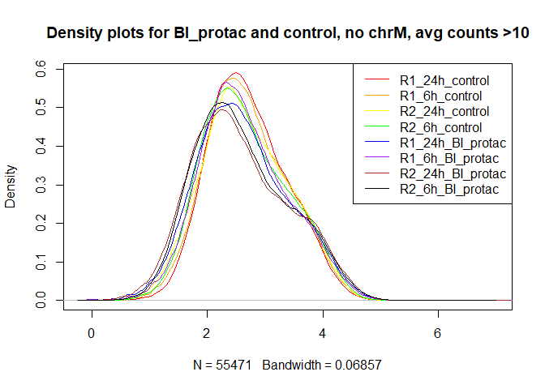

assignment\_6\_erik\_lamoureux
================
Erik Lamoureux
March 4, 2022

-   [Assignment overview](#assignment-overview)
-   [Part 0: Getting ready](#part-0-getting-ready)
-   [Part 1: understanding the
    experiment](#part-1-understanding-the-experiment)
    -   [`#?#` *Make the above plot. Each point should represent one of
        the samples. - 1
        pt*](#-make-the-above-plot-each-point-should-represent-one-of-the-samples---1-pt)
    -   [`#?#` *Can we compare BRM014 to DMSO across all time points?
        Why/why not? - 1
        pt*](#-can-we-compare-brm014-to-dmso-across-all-time-points-whywhy-not---1-pt)
-   [Part 2: QC](#part-2-qc)
    -   [`#?#` Make a plot with read coverage on the y-axis (total
        number of reads) and the samples on the x-axis. - 3
        pt\*](#-make-a-plot-with-read-coverage-on-the-y-axis-total-number-of-reads-and-the-samples-on-the-x-axis---3-pt)
    -   [`#?#` *Which sample has the most coverage? - 0.5
        pt*](#-which-sample-has-the-most-coverage---05-pt)
    -   [`#?#` *Which sample has the least? - 0.5
        pt*](#-which-sample-has-the-least---05-pt)
    -   [`#?#` *What is the % difference between the max and min
        (relative to the min)? - 0.5
        pt*](#-what-is-the--difference-between-the-max-and-min-relative-to-the-min---05-pt)
    -   [`#?#` *Create a new data.frame containing only the BI\_protac
        and control samples - 1
        pt*](#-create-a-new-dataframe-containing-only-the-bi_protac-and-control-samples---1-pt)
    -   [`#?#` *For this subset, calculate the counts per million reads
        (CPM) for each sample - 2
        pt*](#-for-this-subset-calculate-the-counts-per-million-reads-cpm-for-each-sample---2-pt)
    -   [`#?#` *Plot the kernel density estimate for CPM (x axis). 1
        curve per sample, different colours per curve. - 1
        pt*](#-plot-the-kernel-density-estimate-for-cpm-x-axis-1-curve-per-sample-different-colours-per-curve---1-pt)
    -   [`#?#` *Plot the kernel density estimate for log(CPM+1) (x
        axis), coloured as before - 1
        pt*](#-plot-the-kernel-density-estimate-for-logcpm1-x-axis-coloured-as-before---1-pt)
    -   [`#?#` *Why do you think log-transforming is usually performed
        when looking at genomics data? What about adding 1 before log
        transforming? - 2
        pt*](#-why-do-you-think-log-transforming-is-usually-performed-when-looking-at-genomics-data-what-about-adding-1-before-log-transforming---2-pt)
    -   [`#?#` *Some regions have very large CPMs. Inspect the peaks for
        which CPM&gt;400. What do you notice about them? 3
        pt*](#-some-regions-have-very-large-cpms-inspect-the-peaks-for-which-cpm400-what-do-you-notice-about-them-3-pt)
    -   [`#?#` *Calculate the pairwise correlations between log(CPM+1)s
        for the samples and plot them as a heatmap (samples x samples) -
        3
        pt*](#-calculate-the-pairwise-correlations-between-logcpm1s-for-the-samples-and-plot-them-as-a-heatmap-samples-x-samples---3-pt)
    -   [`#?#` *What do you expect the correlations between replicates
        to look like? Is that what you see? - 2
        pt*](#-what-do-you-expect-the-correlations-between-replicates-to-look-like-is-that-what-you-see---2-pt)
    -   [`#?#` *Filter your data, retaining only regions where the
        average counts per sample is greater than 10, and also remove
        mitochondrial regions - 3
        pt*](#-filter-your-data-retaining-only-regions-where-the-average-counts-per-sample-is-greater-than-10-and-also-remove-mitochondrial-regions---3-pt)
    -   [`#?#` *How many peaks did you have before? How many do you have
        now? - 1
        pt*](#-how-many-peaks-did-you-have-before-how-many-do-you-have-now---1-pt)
-   [Part 3: Differential ATAC](#part-3-differential-atac)
    -   [`#?#` *Make a count matrix called `countMatrix` for the
        BI\_protac and control samples, including only the peaks we
        retained above - 2
        pt*](#-make-a-count-matrix-called-countmatrix-for-the-bi_protac-and-control-samples-including-only-the-peaks-we-retained-above---2-pt)
    -   [`#?#` *Make an MA plot for allDEStatsPairedTreatControlvsProtac
        -2pt*](#-make-an-ma-plot-for-alldestatspairedtreatcontrolvsprotac--2pt)
    -   [`#?#` *Make an MA plot for allDEStatsPairedTime6vs24 - 1
        pt*](#-make-an-ma-plot-for-alldestatspairedtime6vs24---1-pt)
    -   [`#?#` *Perform the same differential peak analysis using loess
        regularization. - 1
        pt*](#-perform-the-same-differential-peak-analysis-using-loess-regularization---1-pt)
    -   [`#?#` *Make the same two MA plots as before, but this time
        using the loess normalized analysis - 1
        pt*](#-make-the-same-two-ma-plots-as-before-but-this-time-using-the-loess-normalized-analysis---1-pt)
    -   [`#?#` *What was the first normalization method? What changed in
        the MA plots? Which analysis do you think is more reliable and
        why? - 4
        pt*](#-what-was-the-first-normalization-method-what-changed-in-the-ma-plots-which-analysis-do-you-think-is-more-reliable-and-why---4-pt)
-   [Part 4: GC bias](#part-4-gc-bias)
    -   [`#?#` *Convert the region IDs to a GRanges object - 3
        pt*](#-convert-the-region-ids-to-a-granges-object---3-pt)
    -   [`#?#` *Extract the genomic DNA sequences for each peak using
        hg38 - 3
        pt*](#-extract-the-genomic-dna-sequences-for-each-peak-using-hg38---3-pt)
    -   [`#?#` *Create scatter plots (one per sample, e.g. using
        facet\_wrap), including lines of best fit (GAM), where each plot
        shows GC content (x axis) vs CPM (y axis) for each peak (points)
        -2pt*](#-create-scatter-plots-one-per-sample-eg-using-facet_wrap-including-lines-of-best-fit-gam-where-each-plot-shows-gc-content-x-axis-vs-cpm-y-axis-for-each-peak-points--2pt)
    -   [`#?#` *Repeat the above, but this time showing only the lines
        of best fit and all on the same plot - 2
        pt*](#-repeat-the-above-but-this-time-showing-only-the-lines-of-best-fit-and-all-on-the-same-plot---2-pt)
    -   [`#?#` *Given this result, predict whether we will see a
        significant relationship between GC content and logFC in our
        differential peak analysis (loess-normalized). Justify your
        prediction. Predicting “wrong” will not be penalized, as long as
        your justification is correct. Don’t retroactively change your
        answer. - 2
        pt*](#-given-this-result-predict-whether-we-will-see-a-significant-relationship-between-gc-content-and-logfc-in-our-differential-peak-analysis-loess-normalized-justify-your-prediction-predicting-wrong-will-not-be-penalized-as-long-as-your-justification-is-correct-dont-retroactively-change-your-answer---2-pt)
    -   [`#?#` *Plot the relationship between GC and logFC for the
        loess-normalized ControlvsProtac analysis. Also include a line
        of best fit (blue) and y=0 (red) - 2
        pt*](#-plot-the-relationship-between-gc-and-logfc-for-the-loess-normalized-controlvsprotac-analysis-also-include-a-line-of-best-fit-blue-and-y0-red---2-pt)
    -   [`#?#` *Now plot the same thing for the NON loess-normalized
        ControlvsProtac analysis. - 1
        pt*](#-now-plot-the-same-thing-for-the-non-loess-normalized-controlvsprotac-analysis---1-pt)
    -   [`#?#` *Was your prediction correct? Do you think we should also
        account for GC normalization in our differential ATAC analysis?
        Why/why not? - 3
        pt*](#-was-your-prediction-correct-do-you-think-we-should-also-account-for-gc-normalization-in-our-differential-atac-analysis-whywhy-not---3-pt)
-   [Part 5: Differential analysis
    results](#part-5-differential-analysis-results)
    -   [`#?#` *Suppose we perform the analyses above, redoing the
        differential analysis once more with GC normalization, and also
        considering that we tested loess and the default normalization
        methods. Did we P-hack? Why or why not? - 2
        pt*](#-suppose-we-perform-the-analyses-above-redoing-the-differential-analysis-once-more-with-gc-normalization-and-also-considering-that-we-tested-loess-and-the-default-normalization-methods-did-we-p-hack-why-or-why-not---2-pt)
    -   [`#?#` *Now considering the two comparisons (6 vs 24 hours, and
        protac vs control). EdgeR performed a correction for MHT, but if
        we want to analyze the results from both comparisons, do we need
        to re-adjust to account for the fact that we tested two
        different hypothesis sets (time and treatment)? Why/not? - 2
        pt*](#-now-considering-the-two-comparisons-6-vs-24-hours-and-protac-vs-control-edger-performed-a-correction-for-mht-but-if-we-want-to-analyze-the-results-from-both-comparisons-do-we-need-to-re-adjust-to-account-for-the-fact-that-we-tested-two-different-hypothesis-sets-time-and-treatment-whynot---2-pt)
    -   [`#?#` *How many differential peaks did you find
        (FDR&lt;0.01). - 1
        pt*](#-how-many-differential-peaks-did-you-find-fdr001---1-pt)
    -   [`#?#` *Make a volcano plot of the
        allDEStatsPairedTreatControlvsProtac, with -log10(p-value) on
        the y axis and logFC on the x. Colour points that are
        significant at an FDR&lt;0.01. - 2
        pt*](#-make-a-volcano-plot-of-the-alldestatspairedtreatcontrolvsprotac-with--log10p-value-on-the-y-axis-and-logfc-on-the-x-colour-points-that-are-significant-at-an-fdr001---2-pt)
    -   [`#?#` *Plot the logCPM (x axis) by -log10(Pvalue) (y axis),
        again colouring by FDR&lt;0.01. - 2
        pt*](#-plot-the-logcpm-x-axis-by--log10pvalue-y-axis-again-colouring-by-fdr001---2-pt)
    -   [`#?#` *Do you think our initial filtering on peaks with at
        least 10 reads on average per sample was a good choice? Why or
        why
        not?*](#-do-you-think-our-initial-filtering-on-peaks-with-at-least-10-reads-on-average-per-sample-was-a-good-choice-why-or-why-not)
-   [Authors and contributions](#authors-and-contributions)

# Assignment overview

*Today we will be looking at a differential ATAC-seq dataset between
cells treated with an anti BAF protac and control (untreated) cells. The
cell type is HAP1, a cancer cell line with a near-haploid genome. We
will use this dataset to explore differential analysis. *

*The GEO entry is located here, where you can read more about the
experiments:
<https://www.ncbi.nlm.nih.gov/geo/query/acc.cgi?acc=GSE148175> *

*This is the paper: <https://www.nature.com/articles/s41588-021-00777-3>
*

*“Acute BAF perturbation causes immediate changes in chromatin
accessibility”*

# Part 0: Getting ready

``` r
#install any of these you might not have already
library(ggplot2)
library(edgeR)
```

    ## Warning: package 'edgeR' was built under R version 3.6.2

    ## Loading required package: limma

    ## Warning: package 'limma' was built under R version 3.6.2

``` r
library(reshape)
```

    ## Warning: package 'reshape' was built under R version 3.6.3

``` r
library(GenomicRanges)
```

    ## Loading required package: stats4

    ## Loading required package: BiocGenerics

    ## Loading required package: parallel

    ## 
    ## Attaching package: 'BiocGenerics'

    ## The following objects are masked from 'package:parallel':
    ## 
    ##     clusterApply, clusterApplyLB, clusterCall, clusterEvalQ,
    ##     clusterExport, clusterMap, parApply, parCapply, parLapply,
    ##     parLapplyLB, parRapply, parSapply, parSapplyLB

    ## The following object is masked from 'package:limma':
    ## 
    ##     plotMA

    ## The following objects are masked from 'package:stats':
    ## 
    ##     IQR, mad, sd, var, xtabs

    ## The following objects are masked from 'package:base':
    ## 
    ##     anyDuplicated, append, as.data.frame, basename, cbind, colnames,
    ##     dirname, do.call, duplicated, eval, evalq, Filter, Find, get, grep,
    ##     grepl, intersect, is.unsorted, lapply, Map, mapply, match, mget,
    ##     order, paste, pmax, pmax.int, pmin, pmin.int, Position, rank,
    ##     rbind, Reduce, rownames, sapply, setdiff, sort, table, tapply,
    ##     union, unique, unsplit, which, which.max, which.min

    ## Loading required package: S4Vectors

    ## Warning: package 'S4Vectors' was built under R version 3.6.3

    ## 
    ## Attaching package: 'S4Vectors'

    ## The following objects are masked from 'package:reshape':
    ## 
    ##     expand, rename

    ## The following object is masked from 'package:base':
    ## 
    ##     expand.grid

    ## Loading required package: IRanges

    ## Warning: package 'IRanges' was built under R version 3.6.2

    ## 
    ## Attaching package: 'IRanges'

    ## The following object is masked from 'package:grDevices':
    ## 
    ##     windows

    ## Loading required package: GenomeInfoDb

    ## Warning: package 'GenomeInfoDb' was built under R version 3.6.3

``` r
library(csaw)
```

    ## Loading required package: SummarizedExperiment

    ## Warning: package 'SummarizedExperiment' was built under R version 3.6.2

    ## Loading required package: Biobase

    ## Welcome to Bioconductor
    ## 
    ##     Vignettes contain introductory material; view with
    ##     'browseVignettes()'. To cite Bioconductor, see
    ##     'citation("Biobase")', and for packages 'citation("pkgname")'.

    ## Loading required package: DelayedArray

    ## Warning: package 'DelayedArray' was built under R version 3.6.3

    ## Loading required package: matrixStats

    ## Warning: package 'matrixStats' was built under R version 3.6.3

    ## 
    ## Attaching package: 'matrixStats'

    ## The following objects are masked from 'package:Biobase':
    ## 
    ##     anyMissing, rowMedians

    ## Loading required package: BiocParallel

    ## Warning: package 'BiocParallel' was built under R version 3.6.2

    ## 
    ## Attaching package: 'DelayedArray'

    ## The following objects are masked from 'package:matrixStats':
    ## 
    ##     colMaxs, colMins, colRanges, rowMaxs, rowMins, rowRanges

    ## The following objects are masked from 'package:base':
    ## 
    ##     aperm, apply, rowsum

``` r
library(Biostrings)
```

    ## Loading required package: XVector

    ## 
    ## Attaching package: 'Biostrings'

    ## The following object is masked from 'package:base':
    ## 
    ##     strsplit

``` r
#download the data
#atacSeqData = read.table(textConnection(readLines(gzcon(url("ftp://ftp.ncbi.nlm.nih.gov/geo/series/GSE148nnn/GSE148175/suppl/GSE148175_count_matrix_raw_atac_BRM014_ACBI1.csv.gz")))), sep=",", stringsAsFactors = FALSE, header = TRUE)
# The above line of code gave me errors. I copied the file link from the website and used it below instead:

atacSeqData = read.table(textConnection(readLines(gzcon(url("https://ftp.ncbi.nlm.nih.gov/geo/series/GSE148nnn/GSE148175/suppl/GSE148175%5Fcount%5Fmatrix%5Fraw%5Fatac%5FBRM014%5FACBI1%2Ecsv%2Egz")))), sep=",", stringsAsFactors = FALSE, header = TRUE)

# url <- url("https://ftp.ncbi.nlm.nih.gov/geo/series/GSE148nnn/GSE148175/suppl/GSE148175%5Fcount%5Fmatrix%5Fraw%5Fatac%5FBRM014%5FACBI1%2Ecsv%2Egz")
#gzcon <- gzcon(url)
#readlines <- readLines(gzcon)
#file <- "GSE148175_count_matrix_raw_atac_BRM014_ACBI1.csv.gz"
#download.file(url, destfile = file, mode="wb")
#con <- gzcon(file)
#atacSeqData = read.table(textConnection(readLines(con)), sep=",", stringsAsFactors = FALSE, header = TRUE)
```

``` r
#create a sample metadata data.frame
samples = data.frame(ID = names(atacSeqData)[2:ncol(atacSeqData)])
samples$replicate = gsub("(R[12])_([0-9]+[minh]+)_(.*)$","\\1",samples$ID)
samples$timeName = gsub("(R[12])_([0-9]+[minh]+)_(.*)$","\\2",samples$ID)
samples$treatment = gsub("(R[12])_([0-9]+[minh]+)_(.*)$","\\3",samples$ID)
samples$treatment[samples$treatment=="N"]="BRM014"
samples$time= as.numeric(gsub("[a-z]*","",samples$timeName))
samples$time[grepl("min",samples$timeName)]=samples$time[grepl("min",samples$timeName)]/60
```

# Part 1: understanding the experiment

*Now using `samples` make a plot showing the experimental design, with
time on the x axis, treatment on the y axis, and one plot on the left
and one on the right for the two replicates (e.g. using `facet_grid`).*

### `#?#` *Make the above plot. Each point should represent one of the samples. - 1 pt*

``` r
#here, if the point is there, it means such a sample exists, if absent it means that there is no such sample
p <- ggplot(samples, aes(time, treatment)) + geom_point()

p + facet_grid(cols = vars(replicate))
```

<!-- -->

*In this study, one of the things they were comparing was BRM014 to
DMSO. The drug BRM014 is dissolved in DMSO, so DMSO alone is the
appropriate control to gauge the effect of BRM014.*

### `#?#` *Can we compare BRM014 to DMSO across all time points? Why/why not? - 1 pt*

We cannot compare BRM014 to DMSO across all time points because DMSO
data is only captured at time = 0.0833 and time = 24.0, whereas BRM014
has samples at time 0.0833, 0.1667, 0.5, 1.0, 6.0, and 24.0. Therefore,
accurate comparisons can be obtained at time 0.0833 and 24.0.

# Part 2: QC

*With most genomics data, it is important both that samples have
sufficient coverage, and that the samples have similar coverage. Either
case can lead to underpowered analysis, or misleading results. Calcualte
the read coverage for each sample. *

### `#?#` Make a plot with read coverage on the y-axis (total number of reads) and the samples on the x-axis. - 3 pt\*

``` r
# there are many ways you could do this; one of which is using the melt/cast functions from reshape
#?melt
#head(melt.samples)
#?cast

#melt.samples <- melt(samples)

#cast.samples <- cast(melt.samples, treatment~replicate~variable, length)
#ID <- c('BI_protac', 'BRM014', 'control', 'DMSO')
#cast.samples <- data.frame(ID, cast.samples)
#p <- ggplot(cast.samples, aes(ID, R1.time)) + geom_point()
#p + ggtitle('Read coverage vs. treatment sample (R1)') + xlab('treatment sample') + ylab('number of reads')
#q <- ggplot(cast.samples, aes(ID, R2.time)) + geom_point()
#q + ggtitle('Read coverage vs. treatment sample (R2)') + xlab('treatment sample') + ylab('number of reads')


run_name <- colnames(atacSeqData[2:25])
number_reads <- c(sum(atacSeqData$R1_24h_DMSO), sum(atacSeqData$R1_24h_N), sum(atacSeqData$R1_6h_N), sum(atacSeqData$R1_1h_N), sum(atacSeqData$R1_30min_N), sum(atacSeqData$R1_10min_N), sum(atacSeqData$R1_5min_N), sum(atacSeqData$R1_5min_DMSO), sum(atacSeqData$R1_24h_control), sum(atacSeqData$R1_24h_BI_protac), sum(atacSeqData$R1_6h_BI_protac), sum(atacSeqData$R1_6h_control), sum(atacSeqData$R2_24h_DMSO), sum(atacSeqData$R2_24h_N), sum(atacSeqData$R2_6h_N), sum(atacSeqData$R2_1h_N), sum(atacSeqData$R2_30min_N), sum(atacSeqData$R2_10min_N), sum(atacSeqData$R2_5min_N), sum(atacSeqData$R2_5min_DMSO), sum(atacSeqData$R2_24h_control), sum(atacSeqData$R2_24h_BI_protac), sum(atacSeqData$R2_6h_BI_protac), sum(atacSeqData$R2_6h_control))

num_reads_df <- data.frame(run_name, number_reads)
p <- ggplot(num_reads_df, aes(run_name, number_reads)) + geom_point()

p + ggtitle('Read coverage vs. sample') + xlab('sample') + ylab('number of reads')
```

<!-- -->

### `#?#` *Which sample has the most coverage? - 0.5 pt*

``` r
max_read <- max(num_reads_df$number_reads)
max_read
```

    ## [1] 4686253

``` r
# Therefore, the sample with the most coverage is R1_24h_DMSO with 4686253 reads.
```

### `#?#` *Which sample has the least? - 0.5 pt*

``` r
min_read <- min(num_reads_df$number_reads)
min_read
```

    ## [1] 2341332

``` r
# Therefore, the sample with the least coverage is R1_6h_control with 2341332 reads.
```

### `#?#` *What is the % difference between the max and min (relative to the min)? - 0.5 pt*

``` r
per_diff = ((4686253-2341332)/2341332)*100
per_diff
```

    ## [1] 100.1533

``` r
# Therefore, the percent difference between max and min (relative to min) is 100.1533%.
```

*In cases where samples have vastly different coverage, you can
potentially down-sample the higher-coverage samples. Sometimes, throwing
out the data in this way can also introduce new problems, so we’re going
to stick with the data we have.*

*For this assignment, we will look only at BI\_protac vs control data. *

### `#?#` *Create a new data.frame containing only the BI\_protac and control samples - 1 pt*

``` r
BI_protac_control_df <- data.frame(atacSeqData$region, atacSeqData$R1_24h_control, atacSeqData$R1_6h_control, atacSeqData$R2_24h_control, atacSeqData$R2_6h_control, atacSeqData$R1_24h_BI_protac, atacSeqData$R1_6h_BI_protac, atacSeqData$R2_24h_BI_protac, atacSeqData$R2_6h_BI_protac)

colnames(BI_protac_control_df) <- gsub("atacSeqData.","", colnames(BI_protac_control_df))
```

### `#?#` *For this subset, calculate the counts per million reads (CPM) for each sample - 2 pt*

``` r
# formula for CPM: CPM = readsMappedToGene * (1/totalNumReads) * 10^6

totalNumReads_R1_24h_control <- sum(BI_protac_control_df$R1_24h_control)
totalNumReads_R1_6h_control <- sum(BI_protac_control_df$R1_6h_control)
totalNumReads_R2_24h_control <- sum(BI_protac_control_df$R2_24h_control)
totalNumReads_R2_6h_control <- sum(BI_protac_control_df$R2_6h_control)

totalNumReads_R1_24h_BI_protac <- sum(BI_protac_control_df$R1_24h_BI_protac)
totalNumReads_R1_6h_BI_protac <- sum(BI_protac_control_df$R1_6h_BI_protac)
totalNumReads_R2_24h_BI_protac <- sum(BI_protac_control_df$R2_24h_BI_protac)
totalNumReads_R2_6h_BI_protac <- sum(BI_protac_control_df$R2_6h_BI_protac)

CPM_R1_24h_control <- (BI_protac_control_df$R1_24h_control) * (1 / totalNumReads_R1_24h_control) * (10^6)
CPM_R1_6h_control <- (BI_protac_control_df$R1_6h_control) * (1 / totalNumReads_R1_6h_control) * (10^6)
CPM_R2_24h_control <- (BI_protac_control_df$R2_24h_control) * (1 / totalNumReads_R2_24h_control) * (10^6)
CPM_R2_6h_control <- (BI_protac_control_df$R2_6h_control) * (1 / totalNumReads_R2_6h_control) * (10^6)

CPM_R1_24h_BI_protac <- (BI_protac_control_df$R1_24h_BI_protac) * (1 / totalNumReads_R1_24h_BI_protac) * (10^6)
CPM_R1_6h_BI_protac <- (BI_protac_control_df$R1_6h_BI_protac) * (1 / totalNumReads_R1_6h_BI_protac) * (10^6)
CPM_R2_24h_BI_protac <- (BI_protac_control_df$R2_24h_BI_protac) * (1 / totalNumReads_R2_24h_BI_protac) * (10^6)
CPM_R2_6h_BI_protac <- (BI_protac_control_df$R2_6h_BI_protac) * (1 / totalNumReads_R2_6h_BI_protac) * (10^6)

CPM_df <- data.frame(CPM_R1_24h_control, CPM_R1_6h_control, CPM_R2_24h_control, CPM_R2_6h_control, CPM_R1_24h_BI_protac, CPM_R1_6h_BI_protac, CPM_R2_24h_BI_protac, CPM_R2_6h_BI_protac)
```

### `#?#` *Plot the kernel density estimate for CPM (x axis). 1 curve per sample, different colours per curve. - 1 pt*

``` r
#library(sm)
#attach(CPM_df)

plot(density(CPM_R1_24h_control), col = 'red', main = "Density plots for BI_protac and control")
lines(density(CPM_R1_6h_control), col = 'orange')
lines(density(CPM_R2_24h_control), col = 'yellow')
lines(density(CPM_R2_6h_control), col = 'green')
lines(density(CPM_R1_24h_BI_protac), col = 'blue')
lines(density(CPM_R1_6h_BI_protac), col = 'purple')
lines(density(CPM_R2_24h_BI_protac), col = 'brown')
lines(density(CPM_R2_6h_BI_protac), col = 'black')
legend("topright", legend = c("R1_24h_control", "R1_6h_control", "R2_24h_control", "R2_6h_control", "R1_24h_BI_protac", "R1_6h_BI_protac", "R2_24h_BI_protac", "R2_6h_BI_protac"), col = c("red", "orange", "yellow", "green", "blue", "purple", "brown", "black"), lty = 1)
```

<!-- -->

``` r
#try limiting x-axis

plot(density(CPM_R1_24h_control), col = 'red', xlim = c(0,500), main = "Density plots for BI_protac and control")
lines(density(CPM_R1_6h_control), col = 'orange')
lines(density(CPM_R2_24h_control), col = 'yellow')
lines(density(CPM_R2_6h_control), col = 'green')
lines(density(CPM_R1_24h_BI_protac), col = 'blue')
lines(density(CPM_R1_6h_BI_protac), col = 'purple')
lines(density(CPM_R2_24h_BI_protac), col = 'brown')
lines(density(CPM_R2_6h_BI_protac), col = 'black')
legend("topright", legend = c("R1_24h_control", "R1_6h_control", "R2_24h_control", "R2_6h_control", "R1_24h_BI_protac", "R1_6h_BI_protac", "R2_24h_BI_protac", "R2_6h_BI_protac"), col = c("red", "orange", "yellow", "green", "blue", "purple", "brown", "black"), lty = 1)
```

<!-- -->

### `#?#` *Plot the kernel density estimate for log(CPM+1) (x axis), coloured as before - 1 pt*

``` r
CPM_R1_24h_control_log <- log(CPM_R1_24h_control+1)
CPM_R1_6h_control_log <- log(CPM_R1_6h_control+1)
CPM_R2_24h_control_log <- log(CPM_R2_24h_control+1) 
CPM_R2_6h_control_log <- log(CPM_R2_6h_control+1) 

CPM_R1_24h_BI_protac_log <- log(CPM_R1_24h_BI_protac+1)
CPM_R1_6h_BI_protac_log <- log(CPM_R1_6h_BI_protac+1)
CPM_R2_24h_BI_protac_log <- log(CPM_R2_24h_BI_protac+1)
CPM_R2_6h_BI_protac_log <- log(CPM_R2_6h_BI_protac+1)

plot(density(CPM_R1_24h_control_log), col = 'red', main = "Density plots for BI_protac and control")
lines(density(CPM_R1_6h_control_log), col = 'orange')
lines(density(CPM_R2_24h_control_log), col = 'yellow')
lines(density(CPM_R2_6h_control_log), col = 'green')
lines(density(CPM_R1_24h_BI_protac_log), col = 'blue')
lines(density(CPM_R1_6h_BI_protac_log), col = 'purple')
lines(density(CPM_R2_24h_BI_protac_log), col = 'brown')
lines(density(CPM_R2_6h_BI_protac_log), col = 'black')
legend("topright", legend = c("R1_24h_control", "R1_6h_control", "R2_24h_control", "R2_6h_control", "R1_24h_BI_protac", "R1_6h_BI_protac", "R2_24h_BI_protac", "R2_6h_BI_protac"), col = c("red", "orange", "yellow", "green", "blue", "purple", "brown", "black"), lty = 1)
```

<!-- -->

### `#?#` *Why do you think log-transforming is usually performed when looking at genomics data? What about adding 1 before log transforming? - 2 pt*

Log-transforming is usually performed when looking at genomics data
because the counts per million reads can range from &lt;1 to &gt;50,000.
When the logarithm function is applied, these values range from 0 to 10,
producing output kernel density plots that follow the predicted
histogram shape. A +1 is added because if the count per million reads is
zero, log(zero) is undefined. This way, if the CPM is zero, log(1) = 0.

### `#?#` *Some regions have very large CPMs. Inspect the peaks for which CPM&gt;400. What do you notice about them? 3 pt*

``` r
# log(400) = 2.6
plot(density(CPM_R1_24h_control_log), col = 'red', xlim = c(2.6, 6), main = "Density plots for BI_protac and control, CPM>400")
lines(density(CPM_R1_6h_control_log), col = 'orange')
lines(density(CPM_R2_24h_control_log), col = 'yellow')
lines(density(CPM_R2_6h_control_log), col = 'green')
lines(density(CPM_R1_24h_BI_protac_log), col = 'blue')
lines(density(CPM_R1_6h_BI_protac_log), col = 'purple')
lines(density(CPM_R2_24h_BI_protac_log), col = 'brown')
lines(density(CPM_R2_6h_BI_protac_log), col = 'black')
legend("topright", legend = c("R1_24h_control", "R1_6h_control", "R2_24h_control", "R2_6h_control", "R1_24h_BI_protac", "R1_6h_BI_protac", "R2_24h_BI_protac", "R2_6h_BI_protac"), col = c("red", "orange", "yellow", "green", "blue", "purple", "brown", "black"), lty = 1)
```

<!-- -->

``` r
# The density plot peaks around CPM = 400 (log(401)=2.6) and there is a plateau around log(4000)=3.6 for the BI_protac samples (darker colours).
```

*Normally, we would remove some of these regions before continuing (and
would redo the above steps). Since this is an assignment, we will
continue with the data as-is.*

*Often a good first step is to see if the data look good. One way to do
this is by seeing whether or not the signals in each sample correlate
with each other in ways you expect.*

### `#?#` *Calculate the pairwise correlations between log(CPM+1)s for the samples and plot them as a heatmap (samples x samples) - 3 pt*

``` r
#library(GGally)
#ggcorr(CPM_log_df)
CPM_log_df <- data.frame(CPM_R1_24h_control_log, CPM_R1_6h_control_log, CPM_R2_24h_control_log, CPM_R2_6h_control_log, CPM_R1_24h_BI_protac_log, CPM_R1_6h_BI_protac_log, CPM_R2_24h_BI_protac_log, CPM_R2_6h_BI_protac_log)


corr_R1_24h <- cor(CPM_R1_24h_control_log, CPM_R1_24h_BI_protac_log)
corr_R1_24h
```

    ## [1] 0.8375757

``` r
# correlation for replicate 1 at 24h for control and BI_protac is 0.8375757

corr_R1_6h <- cor(CPM_R1_6h_control_log, CPM_R1_6h_BI_protac_log)
corr_R1_6h
```

    ## [1] 0.8422609

``` r
# correlation for replicate 1 at 6h for control and BI_protac is 0.8422609

corr_R2_24h <- cor(CPM_R2_24h_control_log, CPM_R2_24h_BI_protac_log)
corr_R2_24h
```

    ## [1] 0.8196373

``` r
# correlation for replicate 2 at 24h for control and BI_protac is 0.8196373

corr_R2_6h <- cor(CPM_R2_6h_control_log, CPM_R2_6h_BI_protac_log)
corr_R2_6h
```

    ## [1] 0.9019756

``` r
# correlation for replicate 2 at 6h for control and BI_protac is 0.9019756

corr_matrix <- round(cor(CPM_log_df),2)
melt.corr_matrix <- melt(corr_matrix)
ggplot(melt.corr_matrix, aes(X1, X2, fill=value)) + geom_tile()
```

<!-- -->

### `#?#` *What do you expect the correlations between replicates to look like? Is that what you see? - 2 pt*

I expect the correlations between replicates to be near 1.0. However,
the correlations are lower, ranging from 0.87-0.89 (see below).

CPM\_R2\_24h\_control\_log CPM\_R1\_24h\_control\_log 0.88
CPM\_R2\_6h\_control\_log CPM\_R1\_6h\_control\_log 0.87

CPM\_R2\_24h\_BI\_protac\_log CPM\_R1\_24h\_BI\_protac\_log 0.89
CPM\_R2\_6h\_BI\_protac\_log CPM\_R1\_6h\_BI\_protac\_log 0.89

*It is common to exclude some regions from analysis. For instance, we
won’t be able to robustly identify those that are differential but have
low coverage even if they are truly differential, so there is no point
testing these. We will also remove mitochondrial regions, a common
contaminant of ATAC-seq data.*

### `#?#` *Filter your data, retaining only regions where the average counts per sample is greater than 10, and also remove mitochondrial regions - 3 pt*

``` r
# remove rows containing chrM
BI_control_noMit <- BI_protac_control_df[!grepl("chrM", BI_protac_control_df$region),]
nrow(BI_protac_control_df)
```

    ## [1] 56617

``` r
nrow(BI_control_noMit)
```

    ## [1] 56612

``` r
# retain rows with average > 10
BI_control_noMit_greater10 <- BI_control_noMit[rowMeans(BI_control_noMit[,-1]) > 10,]
nrow(BI_control_noMit_greater10)
```

    ## [1] 55471

### `#?#` *How many peaks did you have before? How many do you have now? - 1 pt*

``` r
# rerun code with BI_control_noMit_greater10

totalNumReads_R1_24h_control <- sum(BI_control_noMit_greater10$R1_24h_control)
totalNumReads_R1_6h_control <- sum(BI_control_noMit_greater10$R1_6h_control)
totalNumReads_R2_24h_control <- sum(BI_control_noMit_greater10$R2_24h_control)
totalNumReads_R2_6h_control <- sum(BI_control_noMit_greater10$R2_6h_control)

totalNumReads_R1_24h_BI_protac <- sum(BI_control_noMit_greater10$R1_24h_BI_protac)
totalNumReads_R1_6h_BI_protac <- sum(BI_control_noMit_greater10$R1_6h_BI_protac)
totalNumReads_R2_24h_BI_protac <- sum(BI_control_noMit_greater10$R2_24h_BI_protac)
totalNumReads_R2_6h_BI_protac <- sum(BI_control_noMit_greater10$R2_6h_BI_protac)

CPM_R1_24h_control <- (BI_control_noMit_greater10$R1_24h_control) * (1 / totalNumReads_R1_24h_control) * (10^6)
CPM_R1_6h_control <- (BI_control_noMit_greater10$R1_6h_control) * (1 / totalNumReads_R1_6h_control) * (10^6)
CPM_R2_24h_control <- (BI_control_noMit_greater10$R2_24h_control) * (1 / totalNumReads_R2_24h_control) * (10^6)
CPM_R2_6h_control <- (BI_control_noMit_greater10$R2_6h_control) * (1 / totalNumReads_R2_6h_control) * (10^6)

CPM_R1_24h_BI_protac <- (BI_control_noMit_greater10$R1_24h_BI_protac) * (1 / totalNumReads_R1_24h_BI_protac) * (10^6)
CPM_R1_6h_BI_protac <- (BI_control_noMit_greater10$R1_6h_BI_protac) * (1 / totalNumReads_R1_6h_BI_protac) * (10^6)
CPM_R2_24h_BI_protac <- (BI_control_noMit_greater10$R2_24h_BI_protac) * (1 / totalNumReads_R2_24h_BI_protac) * (10^6)
CPM_R2_6h_BI_protac <- (BI_control_noMit_greater10$R2_6h_BI_protac) * (1 / totalNumReads_R2_6h_BI_protac) * (10^6)

CPM_df <- data.frame(CPM_R1_24h_control, CPM_R1_6h_control, CPM_R2_24h_control, CPM_R2_6h_control, CPM_R1_24h_BI_protac, CPM_R1_6h_BI_protac, CPM_R2_24h_BI_protac, CPM_R2_6h_BI_protac)

CPM_R1_24h_control_log <- log(CPM_R1_24h_control+1)
CPM_R1_6h_control_log <- log(CPM_R1_6h_control+1)
CPM_R2_24h_control_log <- log(CPM_R2_24h_control+1) 
CPM_R2_6h_control_log <- log(CPM_R2_6h_control+1) 

CPM_R1_24h_BI_protac_log <- log(CPM_R1_24h_BI_protac+1)
CPM_R1_6h_BI_protac_log <- log(CPM_R1_6h_BI_protac+1)
CPM_R2_24h_BI_protac_log <- log(CPM_R2_24h_BI_protac+1)
CPM_R2_6h_BI_protac_log <- log(CPM_R2_6h_BI_protac+1)

plot(density(CPM_R1_24h_control_log), col = 'red', main = "Density plots for BI_protac and control, no chrM, avg counts >10")
lines(density(CPM_R1_6h_control_log), col = 'orange')
lines(density(CPM_R2_24h_control_log), col = 'yellow')
lines(density(CPM_R2_6h_control_log), col = 'green')
lines(density(CPM_R1_24h_BI_protac_log), col = 'blue')
lines(density(CPM_R1_6h_BI_protac_log), col = 'purple')
lines(density(CPM_R2_24h_BI_protac_log), col = 'brown')
lines(density(CPM_R2_6h_BI_protac_log), col = 'black')
legend("topright", legend = c("R1_24h_control", "R1_6h_control", "R2_24h_control", "R2_6h_control", "R1_24h_BI_protac", "R1_6h_BI_protac", "R2_24h_BI_protac", "R2_6h_BI_protac"), col = c("red", "orange", "yellow", "green", "blue", "purple", "brown", "black"), lty = 1)
```

<!-- -->

``` r
# Before, there was one peak near 2.5 and a relative plateau just before 4. This trend is consistent when chrM and rows with < 10 avg samples are removed. However, notably the overall range is reduced from ~10 to ~6.   
```

# Part 3: Differential ATAC

*We want to know what regions are differentially accessible between
BI\_protac and the control.*

*Today, we’re going to use edgeR, which is designed for RNA-seq, but
works well on ATAC-seq as well. The user guide is here:*
<https://www.bioconductor.org/packages/release/bioc/vignettes/edgeR/inst/doc/edgeRUsersGuide.pdf>

### `#?#` *Make a count matrix called `countMatrix` for the BI\_protac and control samples, including only the peaks we retained above - 2 pt*

``` r
countMatrix <- as.matrix(sapply(BI_control_noMit_greater10, as.numeric), na.rm=TRUE)
colnames(countMatrix) <- names(BI_control_noMit_greater10)
rownames(countMatrix) <- BI_control_noMit_greater10[,1]
# delete region col as rows renamed with position
countMatrix <- countMatrix[,-1]

countMatrix_df <- BI_control_noMit_greater10
countMatrix_df <- countMatrix_df[,-1]
```

*EdgeR is exceptionally versatile, with many different options for
analysis. Today, you’re going to use the GLM-quasi-likelihood approach
to calculate differential accessibility. We are providing the first
example analysis below, which you can modify in subsequent steps. You
will need to understand what the steps do, so read the appropriate
documentation. *

``` r
curSamples = samples[match(names(countMatrix_df), samples$ID),];
y = DGEList(counts=countMatrix, group=curSamples$treatment)
y = calcNormFactors(y)
designPaired = model.matrix(~curSamples$treatment + curSamples$timeName)  
# we are using timeName here to make sure that time is treated as a categorical variable. Had we more time points it might make sense to treat time as a value.
y = estimateDisp(y, designPaired)
fitPaired = glmQLFit(y, designPaired)
qlfPairedTime6vs24 = glmQLFTest(fitPaired, coef=3) 
qlfPairedTreatControlvsProtac = glmQLFTest(fitPaired, coef=2)
allDEStatsPairedTreatControlvsProtac = as.data.frame(topTags(qlfPairedTreatControlvsProtac,n=nrow(countMatrix)))
allDEStatsPairedTreatControlvsProtac$region=row.names(allDEStatsPairedTreatControlvsProtac)
allDEStatsPairedTime6vs24 = as.data.frame(topTags(qlfPairedTime6vs24,n=nrow(countMatrix)))
allDEStatsPairedTime6vs24$region=row.names(allDEStatsPairedTime6vs24)
```

*While the differential analysis has been done in this case, before we
look at the results, we are going to check if the data appear to be
normalized correctly. Also include a loess line of best fit, and the
line y=0.*

### `#?#` *Make an MA plot for allDEStatsPairedTreatControlvsProtac -2pt*

``` r
#allDEStatsPairedTreatControlvsProtac <- as.matrix(sapply(allDEStatsPairedTreatControlvsProtac, as.numeric))
#allDEStatsPairedTreatControlvsProtac <- allDEStatsPairedTreatControlvsProtac[,-6]
#DGE_list <- DGEList(allDEStatsPairedTreatControlvsProtac)
#maPlot(allDEStatsPairedTreatControlvsProtac, y=0)

#fitd <- loess(allDEStatsPairedTreatControlvsProtac$logFC ~ allDEStatsPairedTreatControlvsProtac$logCPM)
#my.count <- seq(from=2, to=10, by=0.1)
#pred <- predict(fit, my.count, se=TRUE)


loess_trial <- loess(allDEStatsPairedTreatControlvsProtac$logFC ~ allDEStatsPairedTreatControlvsProtac$logCPM, span=0.5)
smooth <- predict(loess_trial)

plot(allDEStatsPairedTreatControlvsProtac$logFC ~ allDEStatsPairedTreatControlvsProtac$logCPM, xlab="logCPM", ylab="logFC", main= "MA plot - allDEStatsPairedTreatControlvsProtac", col='blue')

lines(smooth, x=allDEStatsPairedTreatControlvsProtac$logCPM, col="red", lty = 3)
lines(abline(h=0, col="black"))
legend("topright", legend = c("MA plot", "Loess regression", "y = 0"), col = c("blue", "red", "black"), lty = 1)
```

<!-- -->

``` r
#lines(pred$fit, lty="solid", col="red")
```

### `#?#` *Make an MA plot for allDEStatsPairedTime6vs24 - 1 pt*

``` r
loess_trial <- loess(allDEStatsPairedTime6vs24$logFC ~ allDEStatsPairedTime6vs24$logCPM, span=0.5)
smooth <- predict(loess_trial)

plot(allDEStatsPairedTime6vs24$logFC ~ allDEStatsPairedTime6vs24$logCPM, xlab="logCPM", ylab="logFC", main= "MA plot - allDEStatsPairedTime6vs24", col='blue')

lines(smooth, x=allDEStatsPairedTime6vs24$logCPM, col="red", lty = 3)
lines(abline(h=0, col="black"))
legend("topright", legend = c("MA plot", "Loess regression", "y = 0"), col = c("blue", "red", "black"), lty = 1)
```

<!-- -->

*Now we’re going to test loess normalization instead.*

### `#?#` *Perform the same differential peak analysis using loess regularization. - 1 pt*

``` r
#Note: the Bioconductor package csaw implements loess regularization in a way that is compatible with edgeR
## Tip: use the csaw library to implement the loess regularization
library(csaw)

#countMatrix = normOffsets(countMatrix, type="loess", lib.sizes=55471)

#y <- as.matrix(offsets, na.rm=TRUE)


curSamples = samples[match(names(countMatrix_df), samples$ID),];
y <- DGEList(counts=countMatrix, group=curSamples$treatment)
#y = calcNormFactors(y)

# use loess regularization function normOffsets from csaw library
data <- SummarizedExperiment(list(counts=y$count))
data$totals <- colSums(y$count)
data <- normOffsets(data, se.out=FALSE)
y$count <- data


#y = normOffsets(y)
designPaired = model.matrix(~curSamples$treatment + curSamples$timeName)  
# we are using timeName here to make sure that time is treated as a categorical variable. Had we more time points it might make sense to treat time as a value.
y = estimateDisp(y, designPaired)


fitPaired = glmQLFit(y, designPaired)
qlfPairedTime6vs24 = glmQLFTest(fitPaired, coef=3) 
qlfPairedTreatControlvsProtac = glmQLFTest(fitPaired, coef=2)
allDEStatsPairedTreatControlvsProtac_loess = as.data.frame(topTags(qlfPairedTreatControlvsProtac,n=nrow(countMatrix)))
allDEStatsPairedTreatControlvsProtac_loess$region=row.names(allDEStatsPairedTreatControlvsProtac)
allDEStatsPairedTime6vs24_loess = as.data.frame(topTags(qlfPairedTime6vs24,n=nrow(countMatrix)))
allDEStatsPairedTime6vs24_loess$region=row.names(allDEStatsPairedTime6vs24)


#data <- SummarizedExperiment(list(counts=y$count))
#data$totals <- colSums(y$count)
#data <- normOffsets(data, se.out=FALSE)

#data <- na.omit(data)
#data <- data[is.finite(rowSums(data)),]
```

### `#?#` *Make the same two MA plots as before, but this time using the loess normalized analysis - 1 pt*

``` r
loess_trial <- loess(allDEStatsPairedTreatControlvsProtac_loess$logFC ~ allDEStatsPairedTreatControlvsProtac_loess$logCPM, span=0.5)
smooth <- predict(loess_trial)

plot(allDEStatsPairedTreatControlvsProtac_loess$logFC ~ allDEStatsPairedTreatControlvsProtac_loess$logCPM, xlab="logCPM", ylab="logFC", main= "Loess MA plot - allDEStatsPairedTreatControlvsProtac", col='blue')

lines(smooth, x=allDEStatsPairedTreatControlvsProtac_loess$logCPM, col="red", lty = 3)
lines(abline(h=0, col="black"))
legend("topright", legend = c("MA plot", "Loess regression", "y = 0"), col = c("blue", "red", "black"), lty = 1)
```

<!-- -->

``` r
loess_trial <- loess(allDEStatsPairedTime6vs24_loess$logFC ~ allDEStatsPairedTime6vs24_loess$logCPM, span=0.5)
smooth <- predict(loess_trial)

plot(allDEStatsPairedTime6vs24_loess$logFC ~ allDEStatsPairedTime6vs24_loess$logCPM, xlab="logCPM", ylab="logFC", main= "Loess MA plot - allDEStatsPairedTime6vs24", col='blue')

lines(smooth, x=allDEStatsPairedTime6vs24_loess$logCPM, col="red", lty = 3)
lines(abline(h=0, col="black"))
legend("topright", legend = c("MA plot", "Loess regression", "y = 0"), col = c("blue", "red", "black"), lty = 1)
```

<!-- -->

### `#?#` *What was the first normalization method? What changed in the MA plots? Which analysis do you think is more reliable and why? - 4 pt*

The first normalization method consisted of calculating normalization
factors to scale the raw library sizes. These factors were specific to
each treatment trial, producing 8 separate normalization factors.
Alternatively, the local weighted regression (loess) normalization
estimates the non-linear bias of logCPM as a function of logFC. Loess
takes small enough slices of the data such that the curve approximated
by a line in that region is fit as a linear line by weighted least
squares. Loess is a more reliable method for normalization because it
captures more of the nuance of the bias by evaluating these small
slices, rather than approximating one value as the normalization
parameter. However, I did not observe marked differences between the
first normalization method and loess normalization.

# Part 4: GC bias

*Next, we will look at potential GC bias in the data. We will again use
bioconductor *

### `#?#` *Convert the region IDs to a GRanges object - 3 pt*

``` r
#note that the names of your peaks are of the format <chr>:<startPos>-<endPos>
## Tip: lookinto the GenomicRanges documentation 
library(regioneR)
```

    ## Warning: package 'regioneR' was built under R version 3.6.2

``` r
G_Ranges_object <- toGRanges(as.matrix(BI_control_noMit_greater10$region))
compiled_df <- data.frame(G_Ranges_object, BI_control_noMit_greater10)
head(compiled_df)
```

    ##   seqnames  start    end width strand             region R1_24h_control
    ## 1     chr1 181169 181759   591      * chr1:181169-181759             19
    ## 2     chr1 183590 184437   848      * chr1:183590-184437             26
    ## 3     chr1 186575 187076   502      * chr1:186575-187076             26
    ## 4     chr1 191183 191808   626      * chr1:191183-191808             34
    ## 5     chr1 629688 630193   506      * chr1:629688-630193           1064
    ## 6     chr1 633778 634279   502      * chr1:633778-634279           2532
    ##   R1_6h_control R2_24h_control R2_6h_control R1_24h_BI_protac R1_6h_BI_protac
    ## 1            17             14            16                9              18
    ## 2            26             20            34               21              31
    ## 3            10              4            14                9               1
    ## 4            18             16            21               33              15
    ## 5           972           1312          1122             1218            1274
    ## 6          2624           3134          2994             3184            3334
    ##   R2_24h_BI_protac R2_6h_BI_protac
    ## 1               17              19
    ## 2               31              31
    ## 3               12               9
    ## 4               27              46
    ## 5             1288            1363
    ## 6             3282            3414

``` r
#gr8 <- toGRanges("chr9:34229289-34982376")
```

### `#?#` *Extract the genomic DNA sequences for each peak using hg38 - 3 pt*

*See for relevant documentation:
<https://bioconductor.org/packages/release/workflows/vignettes/sequencing/inst/doc/sequencing.html>
*

``` r
## Tip: Use the Biostring library 
library(BSgenome.Hsapiens.UCSC.hg38)
```

    ## Loading required package: BSgenome

    ## Loading required package: rtracklayer

``` r
library(Biostrings)

hg38_genome_2 <- getSeq(BSgenome.Hsapiens.UCSC.hg38)
chr_range <- GRanges(compiled_df)
dna_seq <- getSeq(hg38_genome_2, chr_range)
gc_freq <- letterFrequency(dna_seq, "GC", as.prob=TRUE)
```

*Now we will see if there’s any relationship between peak CPM and GC
content for each of the samples.*

### `#?#` *Create scatter plots (one per sample, e.g. using facet\_wrap), including lines of best fit (GAM), where each plot shows GC content (x axis) vs CPM (y axis) for each peak (points) -2pt*

``` r
#please limit the y axis to between 0 and 50
require(gridExtra)
```

    ## Loading required package: gridExtra

    ## Warning: package 'gridExtra' was built under R version 3.6.3

    ## 
    ## Attaching package: 'gridExtra'

    ## The following object is masked from 'package:Biobase':
    ## 
    ##     combine

    ## The following object is masked from 'package:BiocGenerics':
    ## 
    ##     combine

``` r
R1_24h_control_df <- data.frame(gc_freq, CPM_R1_24h_control)
plot1 <-ggplot(R1_24h_control_df, aes(gc_freq, CPM_R1_24h_control)) + geom_point() + ylim(0,50) + geom_smooth() + ggtitle("R1_24h_control")

R1_6h_control_df <- data.frame(gc_freq, CPM_R1_6h_control)
plot2 <- ggplot(R1_6h_control_df, aes(gc_freq, CPM_R1_6h_control)) + geom_point() + ylim(0,50) + geom_smooth() + ggtitle("R1_6h_control")

R2_24h_control_df <- data.frame(gc_freq, CPM_R2_24h_control)
plot3 <- ggplot(R2_24h_control_df, aes(gc_freq, CPM_R2_24h_control)) + geom_point() + ylim(0,50) + geom_smooth() + ggtitle("R2_24h_control")

R2_6h_control_df <- data.frame(gc_freq, CPM_R2_6h_control)
plot4 <- ggplot(R2_6h_control_df, aes(gc_freq, CPM_R2_6h_control)) + geom_point() + ylim(0,50) + geom_smooth() + ggtitle("R2_6h_control")

R1_24h_BI_protac_df <- data.frame(gc_freq, CPM_R1_24h_BI_protac)
plot5 <- ggplot(R1_24h_BI_protac_df, aes(gc_freq, CPM_R1_24h_BI_protac)) + geom_point() + ylim(0,50) + geom_smooth() + ggtitle("R1_24h_BI_protac")

R1_6h_BI_protac_df <- data.frame(gc_freq, CPM_R1_6h_BI_protac)
plot6 <- ggplot(R1_6h_BI_protac_df, aes(gc_freq, CPM_R1_6h_BI_protac)) + geom_point() + ylim(0,50) + geom_smooth() + ggtitle("R1_6h_BI_protac")

R2_24h_BI_protac_df <- data.frame(gc_freq, CPM_R2_24h_BI_protac)
plot7 <- ggplot(R2_24h_BI_protac_df, aes(gc_freq, CPM_R2_24h_BI_protac)) + geom_point() + ylim(0,50) + geom_smooth() + ggtitle("R2_24h_BI_protac")

R2_6h_BI_protac_df <- data.frame(gc_freq, CPM_R2_6h_BI_protac)
plot8 <- ggplot(R2_6h_BI_protac_df, aes(gc_freq, CPM_R2_6h_BI_protac)) + geom_point() + ylim(0,50) + geom_smooth() + ggtitle("R2_6h_BI_protac")

grid.arrange(plot1, plot2, plot3, plot4, plot5, plot6, plot7, plot8, ncol=3)
```

    ## `geom_smooth()` using method = 'gam' and formula 'y ~ s(x, bs = "cs")'

    ## Warning: Removed 2432 rows containing non-finite values (stat_smooth).

    ## Warning: Removed 2432 rows containing missing values (geom_point).

    ## `geom_smooth()` using method = 'gam' and formula 'y ~ s(x, bs = "cs")'

    ## Warning: Removed 2652 rows containing non-finite values (stat_smooth).

    ## Warning: Removed 2652 rows containing missing values (geom_point).

    ## `geom_smooth()` using method = 'gam' and formula 'y ~ s(x, bs = "cs")'

    ## Warning: Removed 2871 rows containing non-finite values (stat_smooth).

    ## Warning: Removed 2871 rows containing missing values (geom_point).

    ## `geom_smooth()` using method = 'gam' and formula 'y ~ s(x, bs = "cs")'

    ## Warning: Removed 3107 rows containing non-finite values (stat_smooth).

    ## Warning: Removed 3107 rows containing missing values (geom_point).

    ## `geom_smooth()` using method = 'gam' and formula 'y ~ s(x, bs = "cs")'

    ## Warning: Removed 3576 rows containing non-finite values (stat_smooth).

    ## Warning: Removed 3576 rows containing missing values (geom_point).

    ## `geom_smooth()` using method = 'gam' and formula 'y ~ s(x, bs = "cs")'

    ## Warning: Removed 3294 rows containing non-finite values (stat_smooth).

    ## Warning: Removed 3294 rows containing missing values (geom_point).

    ## `geom_smooth()` using method = 'gam' and formula 'y ~ s(x, bs = "cs")'

    ## Warning: Removed 4043 rows containing non-finite values (stat_smooth).

    ## Warning: Removed 4043 rows containing missing values (geom_point).

    ## `geom_smooth()` using method = 'gam' and formula 'y ~ s(x, bs = "cs")'

    ## Warning: Removed 3897 rows containing non-finite values (stat_smooth).

    ## Warning: Removed 3897 rows containing missing values (geom_point).

<!-- -->

### `#?#` *Repeat the above, but this time showing only the lines of best fit and all on the same plot - 2 pt*

``` r
compiled_2_df <- data.frame(gc_freq, CPM_R1_24h_control, CPM_R1_6h_control, CPM_R2_24h_control, CPM_R2_6h_control, CPM_R1_24h_BI_protac, CPM_R1_6h_BI_protac, CPM_R2_24h_BI_protac, CPM_R2_6h_BI_protac)

ggplot(compiled_2_df, aes(gc_freq, CPM_R1_24h_control)) + geom_smooth(aes(gc_freq, CPM_R1_24h_control), color="red") + geom_smooth(aes(gc_freq, CPM_R1_6h_control), color="orange") + geom_smooth(aes(gc_freq, CPM_R2_24h_control), color="yellow") + geom_smooth(aes(gc_freq, CPM_R2_6h_control), color="green") + geom_smooth(aes(gc_freq, CPM_R1_24h_BI_protac), color="blue") + geom_smooth(aes(gc_freq, CPM_R1_6h_BI_protac), color="purple") + geom_smooth(aes(gc_freq, CPM_R2_24h_BI_protac), color="brown") + geom_smooth(aes(gc_freq, CPM_R2_6h_BI_protac), color="black") + ylab("CPM")
```

    ## `geom_smooth()` using method = 'gam' and formula 'y ~ s(x, bs = "cs")'
    ## `geom_smooth()` using method = 'gam' and formula 'y ~ s(x, bs = "cs")'
    ## `geom_smooth()` using method = 'gam' and formula 'y ~ s(x, bs = "cs")'
    ## `geom_smooth()` using method = 'gam' and formula 'y ~ s(x, bs = "cs")'
    ## `geom_smooth()` using method = 'gam' and formula 'y ~ s(x, bs = "cs")'
    ## `geom_smooth()` using method = 'gam' and formula 'y ~ s(x, bs = "cs")'
    ## `geom_smooth()` using method = 'gam' and formula 'y ~ s(x, bs = "cs")'
    ## `geom_smooth()` using method = 'gam' and formula 'y ~ s(x, bs = "cs")'

<!-- -->

``` r
#ggplot(compiled_2_df, aes(gc_freq, CPM_R1_6h_control)) + geom_smooth()
```

### `#?#` *Given this result, predict whether we will see a significant relationship between GC content and logFC in our differential peak analysis (loess-normalized). Justify your prediction. Predicting “wrong” will not be penalized, as long as your justification is correct. Don’t retroactively change your answer. - 2 pt*

Given that the CPM vs gc\_freq line of best fit plot looks very similar
for the 8 trials, I predict there will be no significant relationship
between GC content and logFC in our differential peak analysis.

### `#?#` *Plot the relationship between GC and logFC for the loess-normalized ControlvsProtac analysis. Also include a line of best fit (blue) and y=0 (red) - 2 pt*

``` r
df_loess <- data.frame(gc_freq, allDEStatsPairedTreatControlvsProtac_loess$logFC)
ggplot(df_loess, aes(gc_freq, allDEStatsPairedTreatControlvsProtac_loess$logFC)) + geom_point() + geom_smooth() + geom_hline(yintercept=0,color="red")
```

    ## `geom_smooth()` using method = 'gam' and formula 'y ~ s(x, bs = "cs")'

<!-- -->

### `#?#` *Now plot the same thing for the NON loess-normalized ControlvsProtac analysis. - 1 pt*

``` r
df <- data.frame(gc_freq, allDEStatsPairedTreatControlvsProtac$logFC)
ggplot(df, aes(gc_freq, allDEStatsPairedTreatControlvsProtac$logFC)) + geom_point() + geom_smooth() + geom_hline(yintercept=0,color="red")
```

    ## `geom_smooth()` using method = 'gam' and formula 'y ~ s(x, bs = "cs")'

<!-- -->

### `#?#` *Was your prediction correct? Do you think we should also account for GC normalization in our differential ATAC analysis? Why/why not? - 3 pt*

Yes, my prediction was correct. In both default normalization and loess
normalization the best fit line is nearly the same as y=0. Since these
two normalization procedures yield similar plots and trends, I do not
think there is any need for GC normalization in our differential ATAC
analysis. This is because the GC response is roughly constant and would
not benefit from normalization.

*We will leave GC normalization as an optional exercise, and will not
actually do it here.*

# Part 5: Differential analysis results

### `#?#` *Suppose we perform the analyses above, redoing the differential analysis once more with GC normalization, and also considering that we tested loess and the default normalization methods. Did we P-hack? Why or why not? - 2 pt*

If we redid the differential analyses using GC normalization, in
addition to loess and default normalization, this could be considered
p-hacking. Since we saw minimal changes between default and loess
normalization, it seems probable that any potential improvement when
using GC normalization would not be a significant outcome. Since we
would be analyzing the data for a third time and there is no compelling
reason to do GC normalization, I would consider this p-hacking. If our
goal was to compare the normalization procedures, this would be best
done by applying the different normalizations to different datasets.

*Going forward, we will only use the initial analysis (**not loess
normalized**)*

### `#?#` *Now considering the two comparisons (6 vs 24 hours, and protac vs control). EdgeR performed a correction for MHT, but if we want to analyze the results from both comparisons, do we need to re-adjust to account for the fact that we tested two different hypothesis sets (time and treatment)? Why/not? - 2 pt*

When considering the comparison of both time and treatment, and although
EdgeR performed a correction for multiple hypothesis testing with
regards to differing treatments, we would need to re-adjust to account
for the fact that we are testing two different time hypothesis sets.
This is because multiple comparisons performed in a situation are
accompanied by increased type I error problems, so it is necessary to
adjust the p-value accordingly.

Lee S, Lee DK. What is the proper way to apply the multiple comparison
test? Korean J Anesthesiol. 2018;71(5):353-360.
<doi:10.4097/kja.d.18.00242>

### `#?#` *How many differential peaks did you find (FDR&lt;0.01). - 1 pt*

``` r
a <- sum(allDEStatsPairedTreatControlvsProtac$FDR < 0.01)
a
```

    ## [1] 301

``` r
# There are 301 differential peaks in allDEStatsPairedTreatControlvsProtac
b <- sum(allDEStatsPairedTime6vs24$FDR < 0.01)
b
```

    ## [1] 1

``` r
# There is 1 differential peak in allDEStatsPairedTime6vs24
```

### `#?#` *Make a volcano plot of the allDEStatsPairedTreatControlvsProtac, with -log10(p-value) on the y axis and logFC on the x. Colour points that are significant at an FDR&lt;0.01. - 2 pt*

``` r
library(ggplot2)
p <- ggplot(allDEStatsPairedTreatControlvsProtac, aes(x=logFC, y=-log10(PValue))) + geom_point(aes(color = ifelse(FDR<0.01, 'significant','not significant'))) 
p
```

<!-- -->

``` r
#col = ifelse(allDEStatsPairedTreatControlvsProtac$FDR<1, 'red','black')
```

### `#?#` *Plot the logCPM (x axis) by -log10(Pvalue) (y axis), again colouring by FDR&lt;0.01. - 2 pt*

``` r
q <- ggplot(allDEStatsPairedTreatControlvsProtac, aes(x=logCPM, y=-log10(PValue))) + geom_point(aes(color = ifelse(FDR<0.01, 'significant','not significant'))) 
q
```

<!-- -->

### `#?#` *Do you think our initial filtering on peaks with at least 10 reads on average per sample was a good choice? Why or why not?*

Yes, I think initial filtering of peaks with at least 10 reads on
average per sample was a good choice because it reduced the number of
reads from 56612 to 55471, effectively eliminating 1141 low-read samples
of limited and unreliable data.

*At this point there are many other follow ups you can and would do for
a real differential analysis, but we leave these as optional exercises.
For example:* 1. Confirming that the differential peaks look correct
(e.g. CPM heatmap) 2. Confirming that peaks look differential on the
genome browser 3. Looking for motif enrichment 4. Performing a GREAT
analysis, including functional enrichment and assigning peaks to genes

*Knit your assignment as a github\_document and submit the resulting .md
and this .Rmd to your github, and complete the assignment submission on
Canvas. Make sure to include the graphs with your submission. *

# Authors and contributions

Following completion of your assignment, please fill out this section
with the authors and their contributions to the assignment. If you
worked alone, only the author (e.g. your name and student ID) should be
included.

Authors: Erik Lamoureux

Contributions: Assignment completed individually
